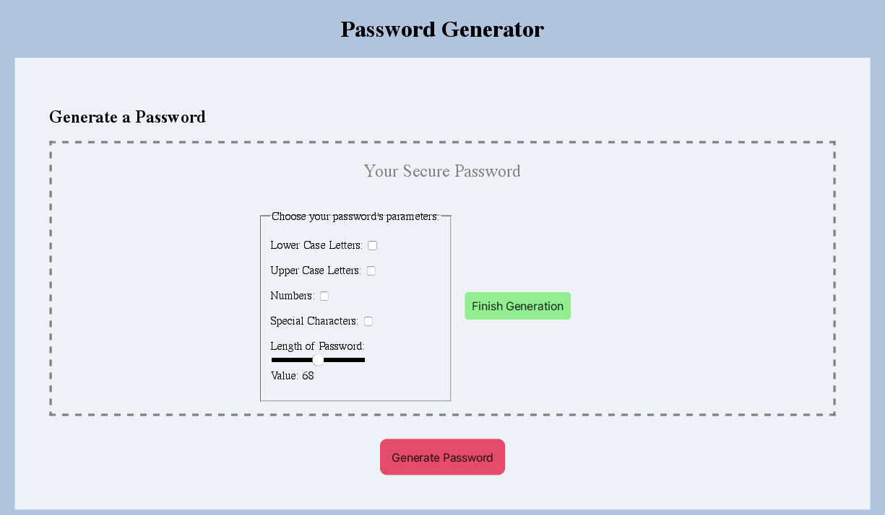

# Berkeley Coding Bootcamp Challenge 3
3nd coding bootcamp challenge where students were asked to create an application that an employee could use to generate a random password based on criteria they've selected. Users can choose if their secure password contains lower-case letters, upper-case letters, numbers, special characters, or a combination of any. Users can also choose the length of their password ranging from 8 to 128 characters. 

The live version of this project can be accessed at: 

